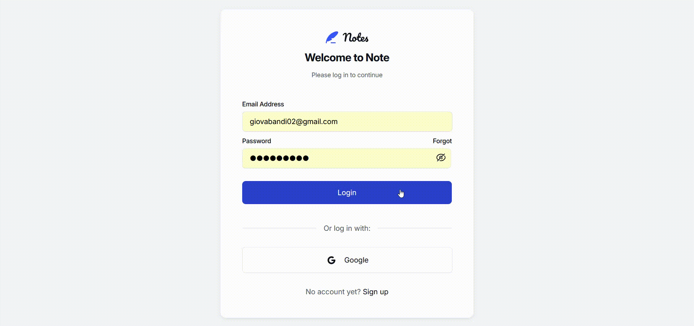

# Note-Taking Web App

A full-stack note-taking application built with the **PERN stack** (PostgreSQL, Express, React, Node.js), Figma files taken from this [Frontend Mentor challenge](https://www.frontendmentor.io/challenges/note-taking-web-app-773r7bUfOG).

## Demo

Showcase of a registered user logging in, changing settings, launching some notes CRUD queries and refreshing the page with JWT stored in localStorage.



## Features

- User Authentication (Register, Login, Google OAuth, Email reset)
- Notes CRUD (create, filter, edit, archive, delete)
- User Preferences (theme and font customization)
- Notifications system (toasts, modals, inline error messages)
- Rate limiting for API endpoints

## Tech Stack

- **Frontend**: React, Vite
- **Backend**: Node.js, Express
- **Database**: PostgreSQL (hosted on Fly.io)
- **Deployment**: Vercel (client), Fly.io (server + db)
- **Auth**: Google OAuth 2.0, JWT
- **Other**: CSS styling with CSS Modules only, using design token taken from the Figma Files

## Limitations and cut out content

- No mobile/tablet layout: MVP optimized for desktop only (≥1000px width).
- No keyboard accessibility
- No markdown/image support in notes

## Getting Started

1. Clone the repository:
   ```bash
   git clone https://github.com/giovanni-bandinelli/NoteTakingWebApp.git
   cd NoteTakingWebApp
   ```

2. Create `.env` files using the provided examples inside `./Client` and `./Server`

3. Install dependencies:
   ```bash
   cd client && npm install
   cd ../server && npm install
   ```

4. To start the webapp run `npm run dev` inside both `Client` and `Server`


## Links

[Live Demo](https://note-taking-web-app-eight-green.vercel.app/).

> Note: The live demo may take a few seconds to load initially due to cold starts on Fly.io.

