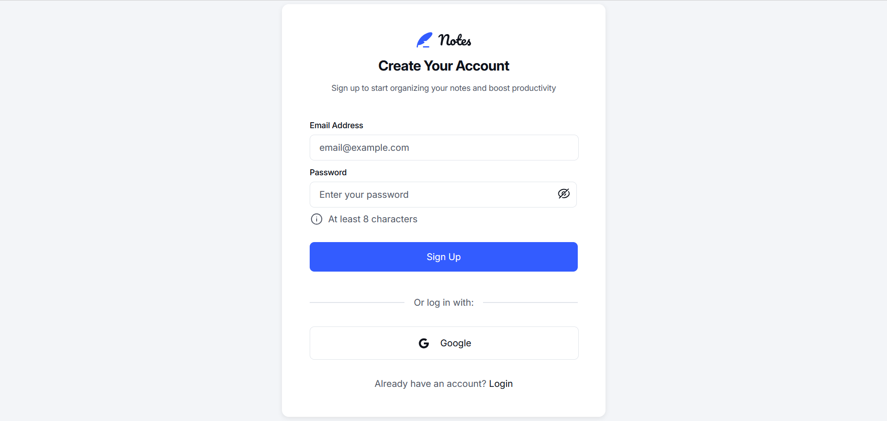
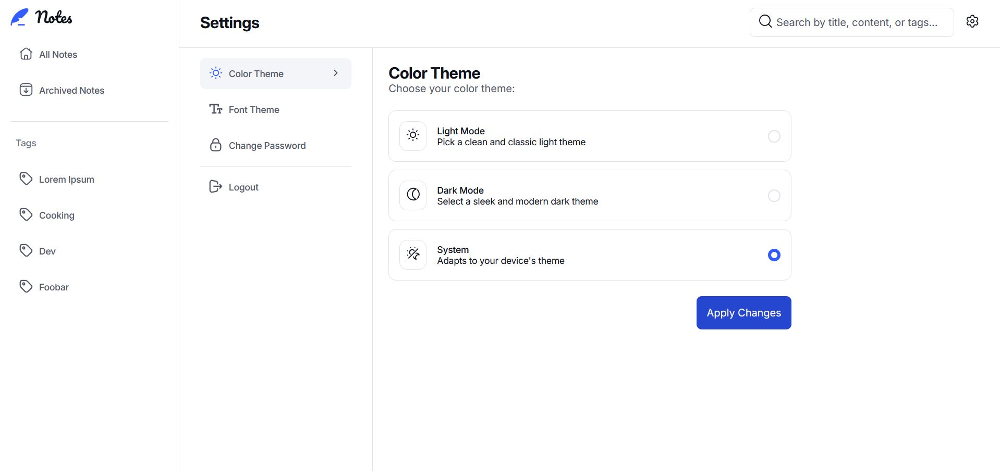
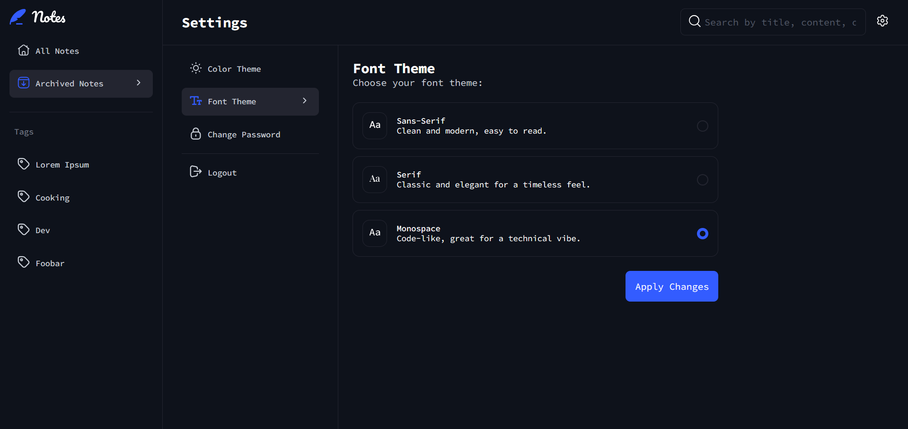

# Note-Taking Web App

A full-stack note-taking application built with the PERN stack (PostgreSQL, Express, React, Node.js), inspired by a [Frontend Mentor challenge](https://www.frontendmentor.io/challenges/note-taking-web-app-773r7bUfOG).

## Features

- User Authentication: Register, Login, Google OAuth, Password reset via email
- Notes CRUD: Create, filter, archive, edit, and delete notes
- User Preferences: Theme and font customization
- Notifications: Toasts, modals, and error handling
- Rate Limiting: Basic API protection via `express-rate-limit`

## Tech Stack

- **Frontend**: React, Vite, CSS Modules
- **Backend**: Node.js, Express, PostgreSQL, Railway
- **Deployment**: Vercel (frontend), Fly.io (backend + DB)
- **Auth**: Google OAuth 2.0, JWT
- **Other**: Docker (local dev), GitHub for version control

## Limitations

This MVP does not include a responsive mobile/tablet layout. The app is best experienced on a desktop device (≥1000px width).

## Screenshots

  
    Light mode
  
  
  
    Dark mode + mono font 
  
  

## License

[Apache-2.0](./LICENSE)

## Links

- Live: [note-taking-web-app-eight-green.vercel.app](https://note-taking-web-app-eight-green.vercel.app)
- GitHub Repo: [github.com/giovanni-bandinelli/NoteTakingWebApp](https://github.com/giovanni-bandinelli/NoteTakingWebApp)

## License

[Apache-2.0](./LICENSE)

